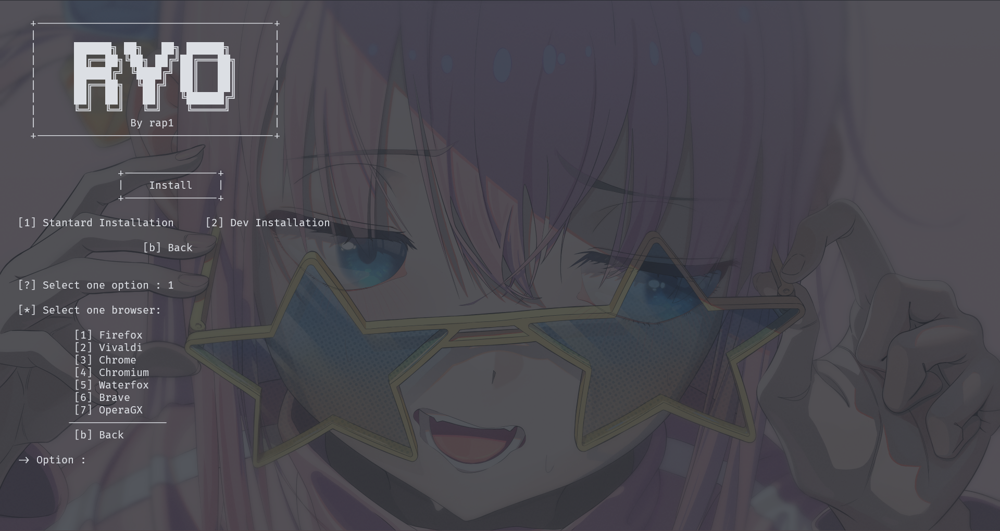

<!-- Header -->
# Ryo

## Ryo is an app installer for windows to make a base installation, and for the dev's one IDE

<h2 align="center">
    
</h2>

<!-- Information -->
### Languages

<p>[ <a href="README.md">English</a> ] [ <a href="README-PT.md">Portuguese</a> ]</p>

### OS version support

| OS      | ✅   |
| ------- | --- |
| Windows 11 | ✓  |
| Windows 10 | ✓  |
| Windows 7 | ✓  |
> Not sure if windows 7 will work properly

<br>

## Usage

<p>To make sure the script runs properly please set the right policy.</p>

- RemoteSigned: Let you run local scripts
- Unsigned: Let you run local scripts and scripts from the internet
> Chose only one.

```powershell
> Set-ExecutionPolicy RemoteSigned
> Set-ExecutionPolicy Unsigned
```

If you get some error and can't do use this
```powershell
> Set-ExecutionPolicy -Scope CurrentUser -ExecutionPolicy RemoteSigned
> Set-ExecutionPolicy -Scope CurrentUser -ExecutionPolicy Unsigned
```

Clone this repository to any location you like
```powershell
> git clone https://github.com/srcrapi/ryo
```

<p>Inside ryo folder add the "src" folder to your path</p>

- Windows (powershell)
```powershell
> [Environment]::SetEnvironmentVariable("PATH", "$env:PATH;C:\Users\user\path\to\your\folder\src\", [System.EnvironmentVariableTarget]::User)
```

<br>

<p>This program still in development and may contain bugs and bad visual.</p>

## Preview





## Issues and Pull requests
<p>
	If you have any issue, just open one. <br>
	<strong>Pull requests Welcome!</strong>
</p>

- <a href="https://github.com/srcrapi/ryo/issues">Issues</a>
- <a href="https://github.com/srcrapi/ryo/pulls">Pull Requests</a>


## Todo

- [ ] **Make more installer options**
- [ ] **Make installer categories instead of base installations**
