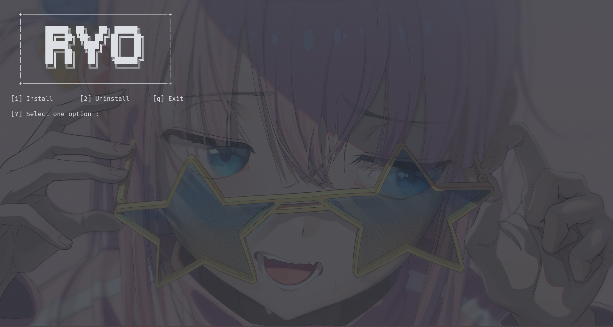

<!-- Header -->

    <h1>Ryo</h1>
    <h2>Ryo is an installer to make a base installation and for the devs one IDE</h2>
    <h2 align="center">
        
    </h2>

<!-- Informations -->
<h3>Languages</h3>

<a href="README.md">English</a>   <a href="README-PT.md">Portuguese</a>

<h3>OS support</h3>

| OS      | ✅   |
| ------- | --- |
| Windows | ✓   |
| Linux   | ✓   |
| MacOS   | ✓   |

This program still in development may contain bugs and bad visual.

<h2>Preview<h2>

